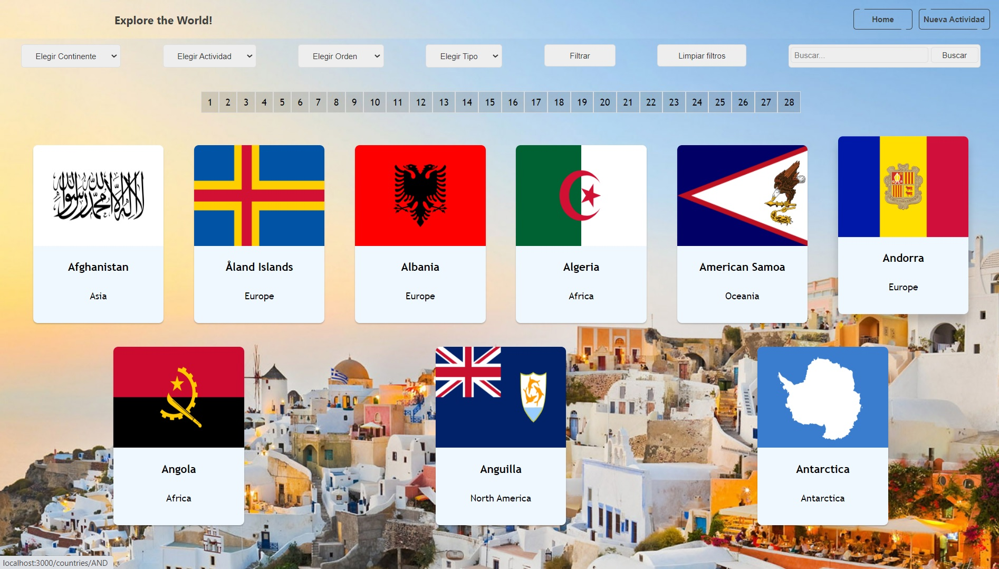
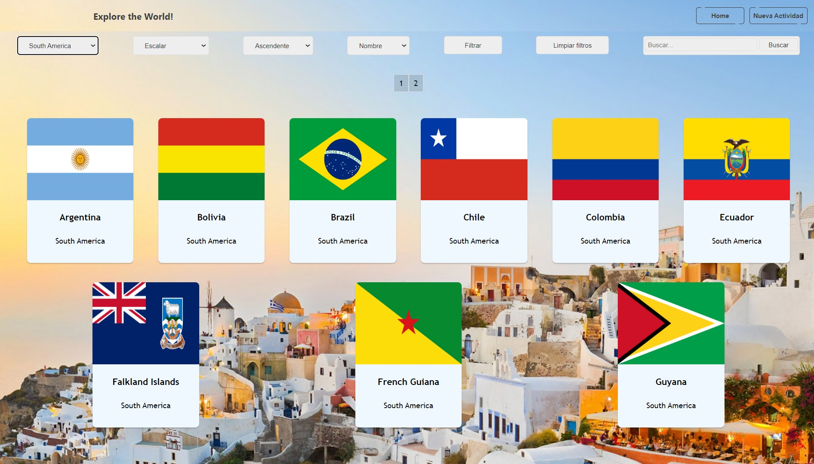
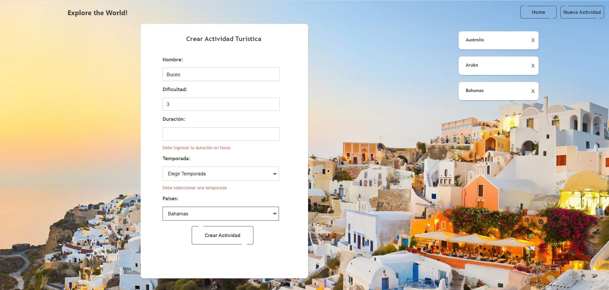
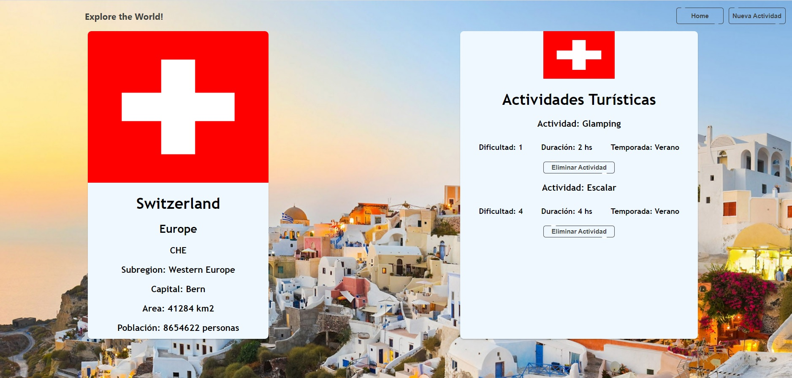

# Individual Project - Henry Countries

<p align="left">
  
</p>

## Acerca del Proyecto

Este proyecto consiste en el desarrollo de una SPA (Single Pagle Application) utilizando
React-Redux para front end, y estilos css sin el uso de librerías externas. La App consume datos de una API externa (https://restcountries.com/) a través de un back end desarrollado en Node.js utilizando Express, Sequelize y PostgreSQL. 
Funcionalidades del proyecto: información de todos los países del mundo y datos detallados de cada país, creación de nuevas actividades turísticas, filtrado por continente y actividad turística, ordenamiento ascendente/descendente por nombre y población y paginación. 

## Objetivos
- Filtrar paises por continente y actividad turística.
- Ordenamiento ascendente/descendente por nombre y población
- Mostrar información general de paises
- Mostrar información detallada de un país en particular
- Creación de nuevas actividades turísticas
- Paginación

## Tecnologías

- Front-End: Javascript, React, Redux, HTML, CSS
- Back-End: NodeJS, Express, Sequealize
- Database: PostgreSQL

## Deploy:

## Instrucciones
Versiones necesarias:
- Node: 12.18.3 or superior
- NPM: 6.14.16 or superior

## BoilerPlate

Clonar el repositorio. El boilerplate cuenta con dos carpetas: `api` y `client`. En estas carpetas estará el código del back-end y el front-end respectivamente.

En `api` crear un archivo llamado: `.env` que tenga la siguiente forma:

```env
DB_USER=usuariodepostgres
DB_PASSWORD=passwordDePostgres
DB_HOST=localhost
```

Reemplazar `usuariodepostgres` y `passwordDePostgres` con tus propias credenciales para conectarte a postgres. Este archivo va ser ignorado en la subida a github, ya que contiene información sensible (las credenciales).

## Conexión con la base de datos

Debes abir yu postgres database manager y crear una base de datos llamada `countries`

## Instalación de paquetes

Abre la consola de visual code:
- dentro de la carpeta api, debes ejecutar en comando npm install
- dentro de la carpeta client, debes ejecutar en comando npm install

## Ejecutar el proyecto

- Abre una consola y situate en la carpeta api, ejecuta el comando npm start
- Abre una consola y situate en la carpeta client, ejecuta el comando npm start, (ve a http://localhost:3000/)

## Screens

<p align="center">
  <p>Página de Inicio</p>
  
</p>

<p align="center">
  <p>Página Principal</p>
  
</p>

<p align="center">
  <p>Filtrado de paises</p>
  
</p>

<p align="center">
  <p>Crear nueva actividad turística</p>
  
</p>

<p align="center">
  <p>Detalle de un país</p>
  
</p>
